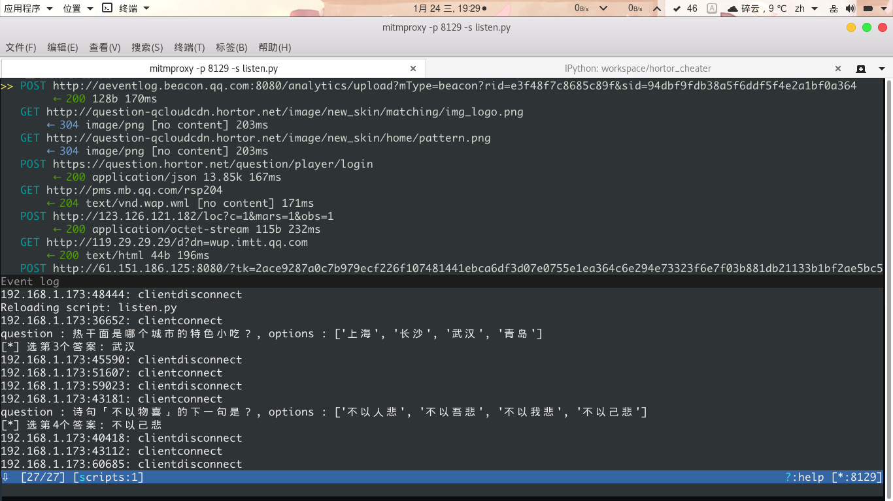

# hortor_cheater

> 王者头脑辅助工具

基于 [mitmproxy](https://github.com/mitmproxy/mitmproxy) 实现, 具体方式是抓包获取数据问题和选项, 先在题库中搜索，如果搜索到了，返回的选项后面会有一个标识[x] 。  
如果是新题，通过百度搜索引擎查询问题,并将答案权重显示在选项后面，并且把题目和答案存入数据库。如果题干是否定（包含“不”，“没有”），选择权重低的，但是权重只提供一个简单的参考。

题库：  
数量 18599条
来源 https://github.com/wansir/tounao/blob/master/data/data.db


mitmproxy加载的python脚本的版本是python3.5
安装mitmproxy请查看：http://docs.mitmproxy.org/en/stable/install.html


安装程序:
```bash
git clone https://github.com/OrangeMeoww/hortor_cheater.git
cd hortor_cheater
pip3 install -r requirments.txt
```

运行程序:

```bash
$ mitmproxy -p 8129  -s listen_v2.py
```

打开 `http://mitm.it` 下载并安装证书, 并设置设备的手动代理到相应地址(eg. 192.168.2.235:8129)


在题库中找到题和答案，会在选项标注正确答案


如果题库中没有找到，会在搜索引擎中搜索，选项在搜索结果中出现的次数, 会显示在选项最后（我就用原作者的老图了）


或者, 输入 "e" 查看日志可以提前看到答案



然后, 就可以轻松王者啦


